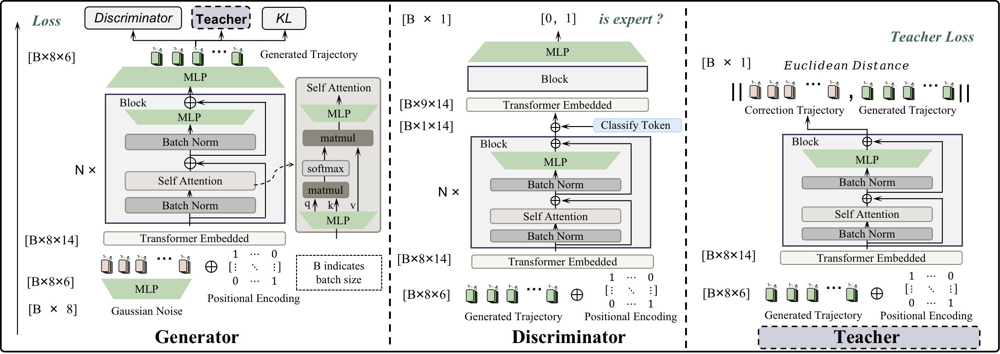

# EditMP

This is the code for [EditMP](https://ieeexplore.ieee.org/document/10149371).

README waits for updated

## Requirements
Python<br>
Pytorch<br>


## Abstract
Movement Primitive (MP) is a promising Learning from Demonstration (LfD) framework, which is commonly used to learn movements from human demonstrations and adapt the learned movements to new task scenes. A major goal of MP research is to improve the adaptability of MP to various target positions and obstacles. MPs enable their adaptability by capturing the variability of demonstrations. However, current MPs can only learn from low-variance demonstrations. The low-variance demonstrations include varied target positions but leave various obstacles alone. These MPs can not adapt the learned movements to the task scenes with different obstacles, which limits their adaptability since obstacles are everywhere in daily life. In this paper, we propose a novel transformer and GAN-based Editable Movement Primitive (EditMP), which can learn movements from high-variance demonstrations. These demonstrations include the movements in the task scenes with various target positions and obstacles. After movement learning, EditMP can controllably and interpretably edit the learned movements for new task scenes. Notably, EditMP enables all robot joints rather than the robot end-effector to avoid hitting complex obstacles. The proposed method is evaluated on three tasks and deployed to a real-world robot. We compare EditMP with probabilistic-based MPs and empirically demonstrate the state-of-the-art adaptability of EditMP.


## Train
```
python exps/mp_train.py 
```
## Acknowledgement
Codebase from [Transgan](https://github.com/VITA-Group/Transgan)
## Citation

If you find this repo is helpful, please cite<br>

@ARTICLE{10149371,
  author={Xu, Xuanhui and You, Mingyu and Zhou, Hongjun and Qian, Zhifeng and Xu, Weisheng and He, Bin},
  journal={IEEE Robotics and Automation Letters}, 
  title={GAN-Based Editable Movement Primitive from High-Variance Demonstrations}, 
  year={2023},
  volume={},
  number={},
  pages={1-8},
  doi={10.1109/LRA.2023.3285473}}
  
Our code has been modified based on Jiang Yifan's Transgan, so please also cite<br>

@article{jiang2021transgan,
  title={Transgan: Two pure transformers can make one strong gan, and that can scale up},
  author={Jiang, Yifan and Chang, Shiyu and Wang, Zhangyang},
  journal={Advances in Neural Information Processing Systems},
  volume={34},
  year={2021}
}

## License

MIT © Xuanhui Xu
